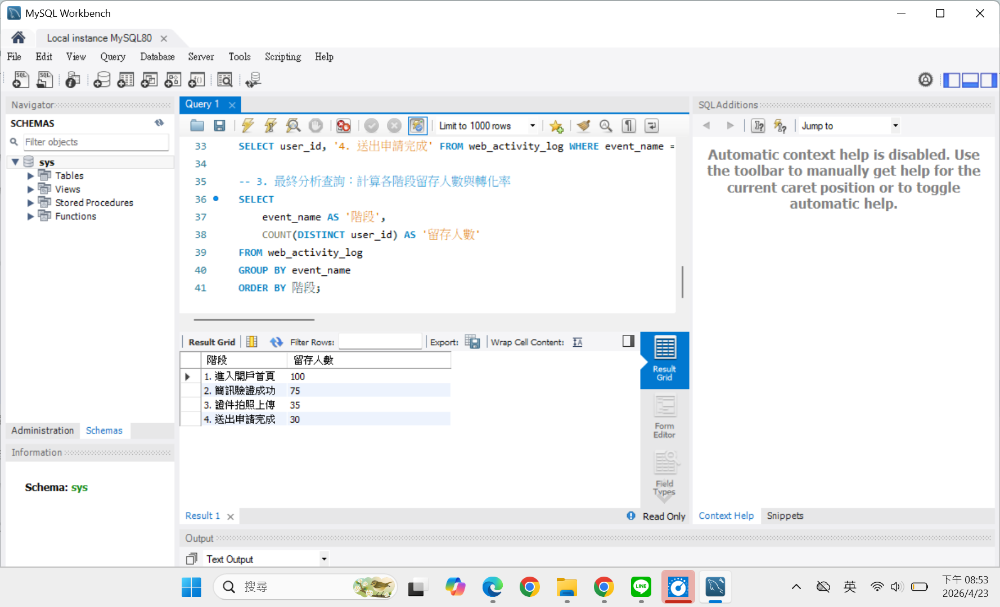
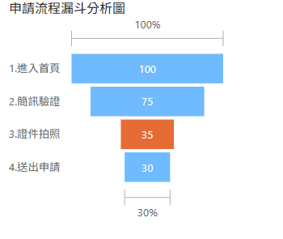

# 📊 FinTech-Data-Analysis
## 專案名稱：數位金融產品申請流程優化分析
### **1. 專案目標**
透過數據分析找出會流失客戶的開戶申請步驟，分析流失原因，並再提出修改方向改善此情況。
 

### **2. 使用工具**
* **數據處理：** `MySQL`
使用 Recursive CTE 與 RAND() 函數建立 100 個用戶，模擬開戶申請時客戶流失的現象。
再來利用 COUNT(DISTINCT user_id) 抓取各階段未流失的客戶，確認客戶流失數量的數據，運用漏斗概念顯示各階段用戶流失情形。

* **視覺化分析：** `Power BI`
視覺化呈現客戶流失現象，特別將主要流失客戶階段標註為橘色。後續再加以分析如何解決問題。

 

### **3. 數據視覺化（Power BI）**
> **
>  
> **SQL數據驗證**

>  

> **
>  
>  **觀察分析：** 從進入首頁到最終送出申請，總轉化率為 30%，各階段轉換率分別是：
>  
進入首頁 → 簡訊驗證：(100 - 75) / 100 =
>  
簡訊驗證 → 證件拍照：(75 - 35) / 75 =
>  
證件拍照 → 送出申請：(35 - 30) / 35 = 

在「證件拍照」階段申請人流失情形最嚴重。

 

### **4. 問題分析 (Insights)**
* **流失痛點：** 數據顯示「證件拍照上傳」步驟流失率高達 55%。
* **可能原因：** 1. 手機端相機權限開啟困難，導致使用者放棄。
    2. 影像辨識（OCR）環境要求過嚴（光線、角度），造成重複嘗試失敗。
    3. 缺乏即時反饋引導，使用者不確定拍攝是否成功。

 

### **5. 改善方法 (Recommendations)**
* **加強拍攝和進度引導，降低使用者轉出率（UI/UX）：**
  在拍照介面加上「僅需3秒就完成」相似字眼，避免使用者在等待期間跳出視窗。

* **流程調整：** 針對辨識失敗多次的用戶，自動引導至手動補件路徑，避免直接跳出。

